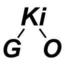

Go language (golang) tree structures (ki = 木 = tree in Japanese)

[](https://goreportcard.com/report/github.com/goki/ki)
[](https://godoc.org/github.com/goki/ki)
[](https://travis-ci.com/goki/ki)

# Overview

See the [Wiki](https://github.com/goki/ki/wiki) for more docs, and [Google Groups goki-gi](https://groups.google.com/forum/#!forum/goki-gi) emailing list.

The **Tree** is the most powerful data structure in programming, and it underlies all the best tech, such as the WWW (the DOM is a tree structure), scene graphs for 3D and 2D graphics systems, JSON, XML, SVG, filesystems, programs themselves, etc.  This is because trees can capture most relevant forms of *structure* (groupings, categories, relationships, etc) and are most powerful when they are fully *generative* -- arbitrary new types can be inserted flexibly.

GoKi provides a powerful tree container type, that can support all of these things just by embedding and extending the `Node` struct type that implements the `Ki` (Ki = Tree in Japanese) `interface`.

The goal of GoKi is to create a minimalist, elegant, and powerful environment (like Go itself) where the tree-based primitives are used to simplify otherwise complex operations.  Similar to MATLAB and matricies, you can perform major computational functions using just a few lines of GoKi code.  As is always the case in programming, using the right data structure that captures the underlying structure of the problem is essential, and in many cases, that structure is a tree.

For example, GoKi provides functions that traverse the tree in the usual relevant ways ("natural" me-first depth-first, me-last depth-first, and breadth-first) and take a `func` function argument, so you can easily apply a common operation across the whole tree in a transparent and self-contained manner, like this:

```go
func (n *MyNode) DoSomethingOnMyTree() {
	n.FuncDownMeFirst(0, nil, func(k Ki, level int, d interface{}) bool {
		mn := KiToMyNode(k)
		mn.DoSomething()
		...
		return ki.Continue // return value determines whether tree traversal continues or not
	})
}
```

Three other core features include:

* A `Signal` mechanism that allows nodes to communicate changes and other events to arbitrary lists of other nodes (similar to the signals and slots from Qt).

* `UpdateStart()` and `UpdateEnd()` functions that wrap around code that changes the tree structure or contents -- these automatically and efficiently determine the highest level node that was affected by changes, and only that highest node sends an `Updated` signal.  This allows arbitrarily nested modifications to proceed independently, each wrapped in their own Start / End blocks, with the optimal minimal update signaling automatically computed.

* `ConfigChildren` uses a list of types and names and performs a minimal, efficient update of the children of a node to configure them to match (including no changes if already configured accordingly).  This is used during loading from JSON, and extensively in the `GoGi` GUI system to efficiently re-use existing tree elements.  There is often complex logic to determine what elements need to be present in a Widget, so separating that out from then configuring the elements that actually are present is efficient and simplifies the code.

In addition, Ki nodes support a general-purpose `Props` property `map`, and the `kit` package provides a `TypeRegistry` and an `EnumRegistry`, along with various `reflect` utilities, to enable fully-automatic saving / loading of Ki trees from JSON or XML, including converting const int (enum) values to / from strings so those numeric values can change in the code without invalidating existing files.

Ki Nodes can be used as fields in a struct -- they function much like pre-defined Children elements, and all the standard FuncDown* iterators traverse the fields automatically.  The Ki Init function automatically names these structs with their field names, and sets the parent to the parent struct.

## GoGi Graphical Interface and Gide IDE App

The first and most important application of GoKi is the [GoGi](https://github.com/goki/gi) graphical interface system, in the `gi` package, and the [Gide](https://github.com/goki/gide) IDE built on top of GoGi.  The scene graph of Ki elements automatically drives minimal refresh updates, and the signaling framework supports gui event delivery and e.g., the "onclick" event signaling from the `Button` widget, etc.  In short, GoGi provides a complete interactive 2D and 3D GUI environment in native Go, in a very compact codebase.  Part of this is the natural elegance of Go, but GoKi enhances that by providing the robust natural primitives needed to express all the GUI functionality.  Because GoGi is based around standard CSS styles, SVG rendering, and supports all the major HTML elements, it could even provide a lightweight, transparent, good-enough-for-many-apps native web browser (someday!)

# Code Map

* `kit` package: `kit.Types` `TypeRegistry` provides name-to-type map for looking up types by name, and types can have default properties. `kit.Enums` `EnumRegistry` provides enum (const int) <-> string conversion, including `bitflag` enums.  Also has robust generic `kit.ToInt` `kit.ToFloat` etc converters from `interface{}` to specific type, for processing properties, and several utilities in `embeds.go` for managing embedded structure types (e.g., `TypeEmbeds` checks if one type embeds another, and `EmbeddedStruct` returns the embedded struct from a given struct, providing flexible access to elements of an embedded type hierarchy -- there are also methods for navigating the flattened list of all embedded fields within a struct).  Also has a `kit.Type` struct that supports saving / loading of type information using type names.

* `bitflag` package: simple bit flag setting, checking, and clearing methods that take bit position args as ints (from const int eunum iota's) and do the bit shifting from there

* `ki.go` = `Ki` interface for all major tree node functionality.

* `slice.go` = `ki.Slice []Ki` supports saving / loading of Ki objects in a slice, by recording the size and types of elements in the slice -- requires `kit.Types` type registry to lookup types by name.

* `props.go` = `ki.Props map[string]interface{}` supports saving / loading of property values using actual `struct` types and named const int enums, using the `kit` type registries.  Used for CSS styling in `GoGi`.

* `signal.go` = `Signal` that calls function on a receiver Ki objects that have been previously `Connect`ed to the signal -- also supports signal type so the same signal sender can send different types of signals over the same connection -- used for signaling changes in tree structure, and more general tree updating signals.

# Status

* April, 2020: version 1.0.0 release -- all stable and well tested.


