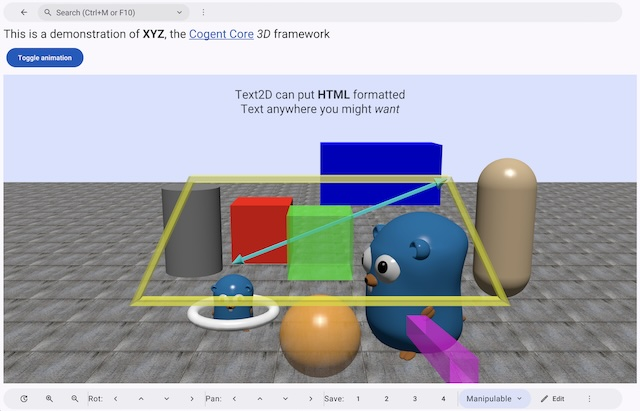

Cogent Core provides interactive 3D viewing and editing widgets through package [[xyz]]. 3D support is currently not present on the web, and the API is subject to change. More documentation will be written for xyz once the API is cleaned up. For now, you can see the [xyz example](https://github.com/cogentcore/core/tree/main/examples/xyz).

Here is a screenshot of the xyz example:

