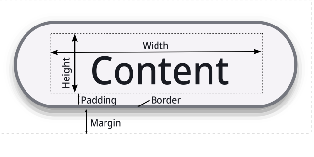

+++
Categories = ["Concepts"]
+++

**Styles** contains explanations of common [[style]] properties. You can also see the API documentation for an [exhaustive list](https://pkg.go.dev/cogentcore.org/core/styles#Style) of style properties. You can experiment with style properties in the [[style playground]].

## Color

Many style properties involve [[color]]s, which can be specified in several ways as documented on that linked page.

You can set the content color of [[text]] or an [[icon]]:

```Go
tx := core.NewText(b).SetText("Success")
tx.Styler(func(s *styles.Style) {
    s.Color = colors.Scheme.Success.Base
})
```

### Background

You can set the background color of a [[widget]]:

```Go
fr := core.NewFrame(b)
fr.Styler(func(s *styles.Style) {
    s.Background = colors.Scheme.Warn.Container
    s.Min.Set(units.Em(5))
})
```

You can use a [[color#gradient]] background:

```Go
fr := core.NewFrame(b)
fr.Styler(func(s *styles.Style) {
    s.Background = gradient.NewLinear().AddStop(colors.Yellow, 0).AddStop(colors.Orange, 0.5).AddStop(colors.Red, 1)
    s.Min.Set(units.Em(5))
})
```

See the [[color]] page for more possible background color options such as an [[color#image]].

## Border

You can add a border to a widget:

```Go
fr := core.NewFrame(b)
fr.Styler(func(s *styles.Style) {
    s.Border.Width.Set(units.Dp(4))
    s.Border.Color.Set(colors.Scheme.Outline)
    s.Min.Set(units.Em(5))
})
```

You can make a dotted or dashed border:

```Go
fr := core.NewFrame(b)
fr.Styler(func(s *styles.Style) {
    s.Border.Style.Set(styles.BorderDotted)
    s.Border.Width.Set(units.Dp(4))
    s.Border.Color.Set(colors.Scheme.Warn.Base)
    s.Min.Set(units.Em(5))
})
```

You can specify different border properties for different sides of a widget (see the documentation for [[doc:styles/sides.Sides.Set]]):

```Go
fr := core.NewFrame(b)
fr.Styler(func(s *styles.Style) {
    s.Border.Width.Set(units.Dp(4))
    s.Border.Color.Set(colors.Scheme.OutlineVariant, colors.Scheme.Primary.Base)
    s.Min.Set(units.Em(5))
})
```

### Border radius

You can make a widget have curved corners, regardless of whether it has a [[#border]]:

```Go
fr := core.NewFrame(b)
fr.Styler(func(s *styles.Style) {
    s.Border.Radius = styles.BorderRadiusLarge
    s.Background = colors.Scheme.Error.Base
    s.Min.Set(units.Em(5))
})
```

## Layout

There are many layout properties that customize the positioning and sizing of widgets, typically using [[unit]]s. See the [[layout]] page for a low-level explanation of the layout process.

The standard box model explains the meaning of different size elements:



### Size

You can control the size of a widget through three properties: `Min`, `Max`, and `Grow`.

#### Min

Min specifies the minimum size that a widget must receive:

```Go
fr := core.NewFrame(b)
fr.Styler(func(s *styles.Style) {
    s.Min.Set(units.Em(5))
    s.Background = colors.Scheme.Primary.Base
})
```

Min (and Max and Grow) can be specified for each dimension:

```Go
fr := core.NewFrame(b)
fr.Styler(func(s *styles.Style) {
    s.Min.Set(units.Em(10), units.Em(3))
    s.Background = colors.Scheme.Primary.Base
})
```

#### Grow

Grow makes a widget fill the available space up to Max:

```Go
fr := core.NewFrame(b)
fr.Styler(func(s *styles.Style) {
    s.Grow.Set(1, 1)
    s.Min.Set(units.Em(5))
    s.Background = colors.Scheme.Primary.Base
})
```

#### Max

Max puts a constraint on the amount a widget can Grow:

```Go
fr := core.NewFrame(b)
fr.Styler(func(s *styles.Style) {
    s.Grow.Set(1, 1)
    s.Min.Set(units.Em(5))
    s.Max.Set(units.Em(10))
    s.Background = colors.Scheme.Primary.Base
})
```

In the example above, notice that the [[frame]] has a size of 10em in the X direction, but only 5em in the Y direction. That is because the widget has room to grow in the X direction and thus reaches the Max, but there are many other widgets competing for space in the Y direction, so it stays at its Min.

Max can also be used to limit the size of a widget without Grow:

```Go
fr := core.NewFrame(b)
fr.Styler(func(s *styles.Style) {
    s.Max.X.Em(10)
})
core.NewButton(fr).SetText("First")
core.NewButton(fr).SetText("Second")
core.NewButton(fr).SetText("Third")
```

### Position

You can control the positioning of the elements of a [[frame]] or other container widget in several ways.

#### Direction

You can position widgets in a column instead of in a row:

```Go
fr := core.NewFrame(b)
fr.Styler(func(s *styles.Style) {
    s.Direction = styles.Column
})
core.NewButton(fr).SetText("First")
core.NewButton(fr).SetText("Second")
core.NewButton(fr).SetText("Third")
```

#### Grid

You can position widgets in a grid:

```Go
fr := core.NewFrame(b)
fr.Styler(func(s *styles.Style) {
    s.Display = styles.Grid
    s.Columns = 2
})
core.NewButton(fr).SetText("First")
core.NewButton(fr).SetText("Second")
core.NewButton(fr).SetText("Third")
core.NewButton(fr).SetText("Fourth")
```

#### Gap

You can change the space between widgets:

```Go
fr := core.NewFrame(b)
fr.Styler(func(s *styles.Style) {
    s.Gap.Set(units.Em(3))
})
core.NewButton(fr).SetText("First")
core.NewButton(fr).SetText("Second")
core.NewButton(fr).SetText("Third")
```

### Alignment

*Note: we recommend experimenting with alignment properties in the [[style playground]] to get a better sense of how they work.*

You can use the CenterAll helper function to center widgets in all possible ways:

```Go
fr := core.NewFrame(b)
fr.Styler(func(s *styles.Style) {
    s.CenterAll()
    s.Grow.Set(1, 1)
    s.Min.Set(units.Em(10))
    s.Background = colors.Scheme.SurfaceContainerHigh
})
core.NewButton(fr).SetText("First")
core.NewButton(fr).SetText("Second")
core.NewButton(fr).SetText("Third")
```

#### Justify

You can change the distribution of widgets on the main axis:

```Go
fr := core.NewFrame(b)
fr.Styler(func(s *styles.Style) {
    s.Justify.Content = styles.Center
    s.Grow.Set(1, 0)
})
core.NewButton(fr).SetText("First")
core.NewButton(fr).SetText("Second")
core.NewButton(fr).SetText("Third")
```

#### Align

You can change the alignment of widgets on the cross (non-main) axis:

```Go
fr := core.NewFrame(b)
fr.Styler(func(s *styles.Style) {
    s.Align.Content = styles.End
    s.Min.Y.Em(10)
    s.Background = colors.Scheme.SurfaceContainerHigh
})
core.NewButton(fr).SetText("First")
core.NewButton(fr).SetText("Second")
core.NewButton(fr).SetText("Third")
```

### Overflow

You can make a container add scrollbars when it overflows:

```Go
fr := core.NewFrame(b)
fr.Styler(func(s *styles.Style) {
    s.Overflow.X = styles.OverflowAuto
    s.Max.X.Em(10)
})
core.NewButton(fr).SetText("First")
core.NewButton(fr).SetText("Second")
core.NewButton(fr).SetText("Third")
```

#### Wrap

You can make a container wrap when it overflows:

```Go
fr := core.NewFrame(b)
fr.Styler(func(s *styles.Style) {
    s.Wrap = true
    s.Min.X.Em(20)
})
core.NewButton(fr).SetText("First")
core.NewButton(fr).SetText("Second")
core.NewButton(fr).SetText("Third")
core.NewButton(fr).SetText("Fourth")
core.NewButton(fr).SetText("Fifth")
```

## Text

You can customize the appearance of [[text]] with various properties.

### Font weight

You can change the font weight of text:

```Go
tx := core.NewText(b).SetText("Bold text")
tx.Styler(func(s *styles.Style) {
    s.Font.Weight = rich.Bold
})
```

### Font slant

You can make text italic:

```Go
tx := core.NewText(b).SetText("Italic text")
tx.Styler(func(s *styles.Style) {
    s.Font.Slant = rich.Italic
})
```

### Font family

You can change the font family category of text:

```Go
tx := core.NewText(b).SetText("Monospaced text")
tx.Styler(func(s *styles.Style) {
    s.Font.Family = rich.Monospace
})
```

You can use a specific font family:

```Go
tx := core.NewText(b).SetText("Specific font")
tx.Styler(func(s *styles.Style) {
    s.Font.Family = rich.Custom
    s.Font.CustomFont = "Arial"
})
```

You can also embed [[font#custom fonts]] and use them (see that page for details):

```go
fonts.AddEmbedded(MyFontName)
tx := core.NewText(b).SetText("Custom font")
tx.Styler(func(s *styles.Style) {
    s.Font.Family = rich.Custom
    s.Font.CustomFont = "My Font Name"
})
```

### Line height

You can change the height of each line of text:

```Go
tx := core.NewText(b).SetText("This is some text with a large line height")
tx.Styler(func(s *styles.Style) {
    s.Text.LineHeight = 2
    s.Max.X.Em(10)
})
```

### Whitespace

You can customize the formatting of whitespace:

```Go
tx := core.NewText(b).SetText("This text\nformats      whitespace\n    as is")
tx.Styler(func(s *styles.Style) {
    s.Text.WhiteSpace = text.WhiteSpacePre
})
```

### Text wrap

You can disable text wrapping:

```Go
tx := core.NewTextField(b).SetText("This text never wraps even if it exceeds the maximum width")
tx.Styler(func(s *styles.Style) {
    s.SetTextWrap(false)
})
```
