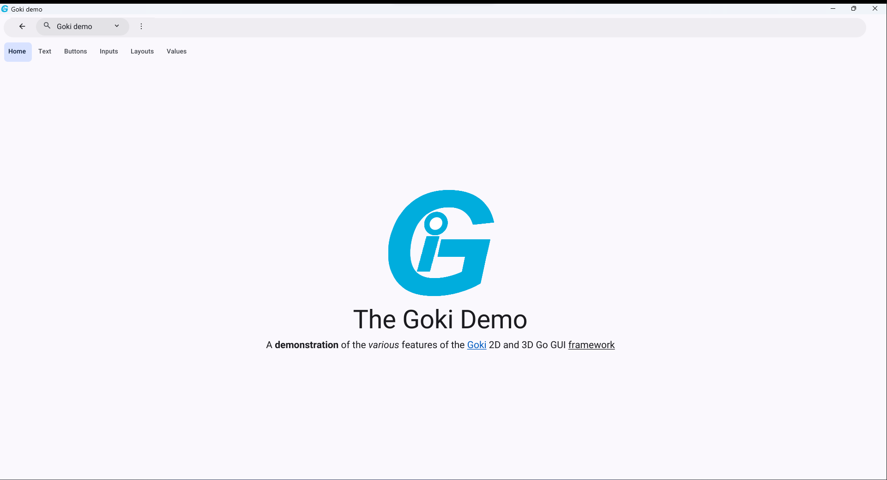

# Running the demo

To run the Goki Demo on your device, run `go run goki.dev/examples/demo@latest` or go to [goki.dev/demo](https://goki.dev/demo) to see the Goki Demo in your browser. Either of these options should create a window/tab similar to the one below: 

